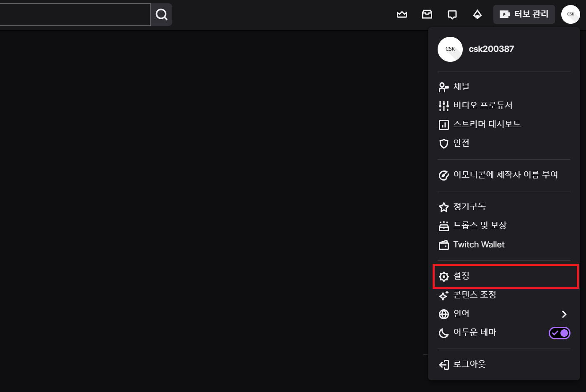
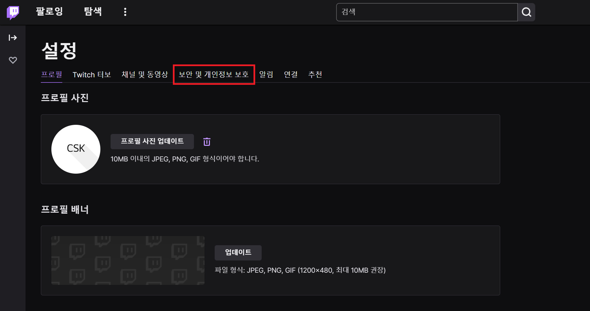
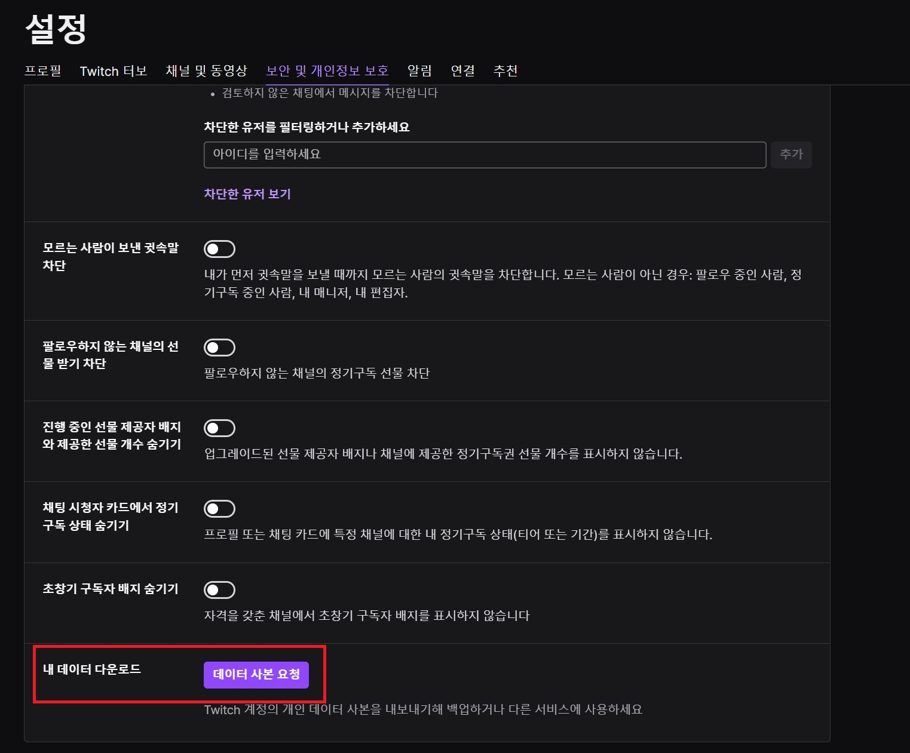
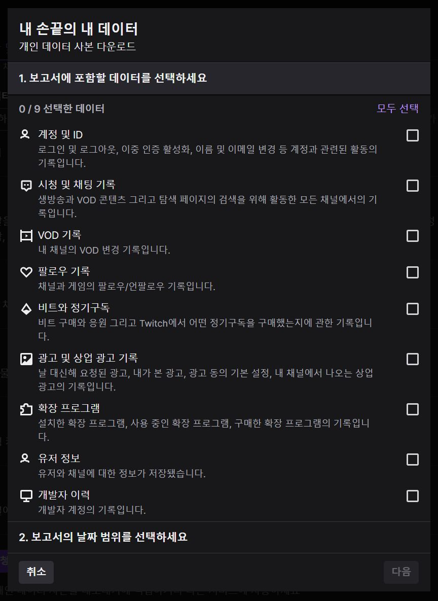
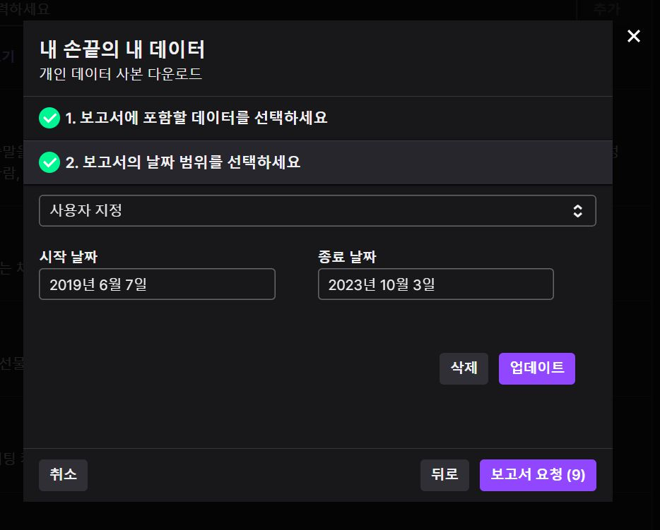
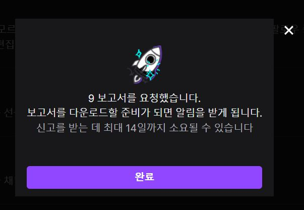

# 데이터 준비하기

유저 통계 분석을 위한 데이터를 다운받는 방법을 설명합니다.

## 1. 설정

## 2. 보안 및 개인정보 보호

## 3. 내 데이터 다운로드

## 4. 데이터 카테고리 선택

## 5. 날짜 범위 지정

분석할 데이터의 날짜 범위를 지정할 수 있습니다.
시작 날짜는 자신의 계정 생성일로 설정하는 것을 추천드립니다.

**[계정 생성일 조회하기](https://www.google.com/)**

## 6. 완료

19년도에 계정을 생성한 저의 경우는 약 10일 정도 소요되었습니다.
데이터가 도착하면 압축파일의 형태로 다운받을 수 있습니다.